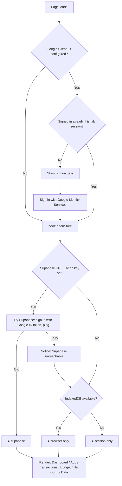

# Ledger — Expense Tracker 2026

A static UI on GitHub Pages that reads and writes a **Supabase/Postgres**
database, with IndexedDB/in-memory storage as an automatic offline fallback.
Add, edit or delete an expense and the change lands immediately in whichever
backend is active. Charts and the dashboard render from that same data.

No server of your own. No build step. No npm install for the app itself.

---

## How it decides where your data lives

Every page load runs the same decision chain — `openStore()` in
`assets/store.js` — and the small `●` indicator in the top-right corner of
the app always tells you which branch it landed on. Supabase is tried first
if configured; if it's not configured, or the connection fails, the app
falls back to storing data locally in the browser.



Whichever backend is active, `app.js` never knows the difference — it only
ever calls `state.store.list()` / `.add()` / `.getBudget()` / etc. All three
adapters (`SupabaseStore`, `LocalStore`, `MemoryStore`) implement the same
shape.

**Supabase RLS must be applied before real data touches it.** The client is
fully wired (sign-in, reads, writes, budget, balances, debts), and
`supabase/schema.sql` ships in this repo with the full schema and Row Level
Security policies — but nothing applies it for you. Don't point
`SUPABASE_URL` at a project holding real data until that file has actually
been run against it (Supabase Dashboard → SQL Editor); an anon key with no
RLS is equivalent to handing out full read/write access to anyone who opens
the page.

---

## Read this before you deploy

### 1. GitHub Secrets cannot keep a secret in a static site

Secrets exist at Actions **build** time. The workflow writes yours into
`assets/config.js`, which is then **served to every visitor**. Anyone can
open devtools and read your Supabase URL and anon key.

So the secret keeps values out of your **repository**, not out of your
**deployed page**. That is a real difference — it stops the URL/key leaking
through a public repo, git history, or a fork — but it is not access
control.

|                                      | Visible in repo | Visible on deployed site |
| ------------------------------------ | --------------- | ------------------------ |
| Hardcoded in `config.js`             | **Yes**         | Yes                      |
| Injected from GitHub secret          | No              | **Yes**                  |
| Entered at runtime (Data → Supabase) | No              | **No**                   |

**If your Supabase project holds anything you would mind a stranger reading
or writing, leave the secrets unset and enter the URL/key in the app.** It
is stored in your browser's localStorage and never published. You type it
once per browser.

The Supabase URL and anon key alone aren't the gate — every request still
has to carry a valid Google ID token, which Supabase Auth verifies and Row
Level Security checks against `allowed_emails`, regardless of whether the
URL/key were baked in via secrets or typed in at runtime. Keeping them off
the public page is still worth doing (it's one less thing a stranger can
find and start probing), just not the thing actually stopping writes.

The Google Client ID and Supabase anon key are both meant to be public —
access is enforced server-side by Supabase RLS, not by hiding the
identifier.

---

## Setup

### Step 1 — Google sign-in (required)

Every request must carry a signed Google ID token, which Supabase Auth
verifies and Row Level Security checks against an email allow-list before
touching any table.

1. [console.cloud.google.com](https://console.cloud.google.com) → new
   project → APIs & Services → Credentials → **Create OAuth client ID** →
   Web application.
2. Authorised JavaScript origins: your GitHub Pages URL, plus
   `http://localhost:8080` if you run the app locally.
3. Paste the client ID into `GOOGLE_CLIENT_ID` in `assets/config.js` (or the
   `GOOGLE_CLIENT_ID` repo secret).

The client ID itself is public by design — it appears in the page source.
Security comes from the origin restriction on the OAuth client plus RLS's
server-side email check, not from hiding the ID.

### Step 2 — Supabase

`assets/store.js` implements a full `SupabaseStore` adapter — signed in via
the same Google ID token the app already obtains (`signInWithIdToken`),
reading and writing `transactions`/`budget`/`balances`/`debts` tables
through `supabase-js`. To set it up:

1. Create a project at [supabase.com](https://supabase.com).
2. **Authentication → Providers → Google** → enable it, and add your app's
   `GOOGLE_CLIENT_ID` under **Authorized Client IDs**. This is a per-project
   setting, unrelated to how you personally log into supabase.com.
3. **SQL Editor → New query** → paste and run all of
   `supabase/schema.sql`. This creates the four tables, enables RLS on all
   of them, and seeds `allowed_emails` with two placeholder addresses —
   **edit that `insert` statement to your own household's emails before
   running it**, or update the table afterwards.
4. Verify RLS is actually blocking anonymous access — the query to run is
   in the comment at the bottom of `supabase/schema.sql`. You should get
   back `[]`, not real rows.
5. Copy **Project Settings → API → Project URL** and the **anon/public
   key**, and set `SUPABASE_URL`/`SUPABASE_ANON_KEY` (build-time secret, or
   paste directly into `assets/config.js` for local testing only — never
   commit real values there).

`migrate.mjs` does a one-time bulk load of a Ledger `.xlsx` export into
Postgres over a direct connection string, with mandatory reconciliation
(row counts and per-type sums must match exactly between the export and
what landed in the database, or it refuses to report success). It's a
standalone Node script (`node migrate.mjs <export.xlsx>
--db-url=postgres://... [--dry-run]`), not part of the deployed app.

### Step 3 — Deploy the frontend

```bash
git init && git add . && git commit -m "Ledger"
git branch -M main
git remote add origin https://github.com/<you>/<repo>.git
git push -u origin main
```

**Settings → Pages → Source: GitHub Actions.** (Not "Deploy from a branch" —
the workflow needs to generate `config.js` first.)

Optional, per the warning above — **Settings → Secrets and variables →
Actions**:

| Secret              | Value                              |
| ------------------- | ---------------------------------- |
| `GOOGLE_CLIENT_ID`  | the OAuth client ID                |
| `SUPABASE_URL`      | your Supabase project URL          |
| `SUPABASE_ANON_KEY` | the project's anon/publishable key |

Skip all of them to keep every value off the public page; connect under
**Data → Supabase** instead, which stores the URL and key only in your
browser.

### Local development

```bash
python3 -m http.server 8080   # http://localhost:8080
```

ES modules need an HTTP origin; opening `index.html` from disk fails on
CORS.

---

## Data model

One row per transaction. **Amount is always positive** — `type` carries the
sign. This keeps aggregation clean in exports, and is enforced in the form,
in `normalise()`, and in `supabase/schema.sql`'s `check` constraint.

```
id  date  type  category  subcategory  description  amount  payment  account  recurring  notes  person
```

`person` (`Ramesh`, `Surya`, `Joint`, or unassigned) was added after the
initial import; rows without it are treated as `Unassigned` everywhere.

Budget is one row per category/year/month in the `budget` table. **Zero
means "not budgeted"** and is excluded from Budget Used calculations.

Net worth (dated Asset/Liability balance snapshots, `balances` table) and
Debts & Loans (principal + payment history, `debts` table) are tracked
separately from Income/Expense so a balance or a receivable is never
double-counted against actual cash flow. Dividends is its own transaction
`type`, excluded from Income and Savings Rate, shown in its own Dashboard
section.

The app rereads from Supabase on load and on **Data → Reload from
Supabase**.

---

## Known gaps

- **No payment methods in some imported data** — rows imported before this
  field existed leave the doughnut chart under-attributed. The dashboard
  reports how much spend is unattributed rather than hiding it.
- **Import expects a flat table** with `Date` and `Amount` columns.
- **No offline queue.** Lose connectivity and writes fail loudly rather
  than silently diverging from the backend.
- **`SupabaseStore` doesn't populate a "known years" list up front** — the
  Dashboard's year selector reflects years already lazy-loaded rather than
  every year that exists in the data, until you've viewed them once.
- Keep `allowed_emails` in `supabase/schema.sql` in sync by hand with who
  should actually have access — nothing enforces it automatically.

---

## Layout

```
index.html                    app shell + sign-in gate + connection indicator
assets/config.js               Google client ID / Supabase URL+key config; overwritten at deploy
assets/store.js                SupabaseStore / IndexedDB / memory adapters + constants
assets/xlsxio.js               aggregation, xlsx export, import with header aliasing
assets/charts.js                Chart.js builders
assets/app.js                  routing, views, forms, Google sign-in gate, global state
supabase/schema.sql             tables + Row Level Security policies; paste into SQL Editor
migrate.mjs                     one-time XLSX → Postgres bulk loader (not part of the deployed app)
.github/workflows/deploy.yml    injects secrets, validates, publishes to Pages
```

From CDN, no install: Chart.js 4.4.1, SheetJS 0.20.3, Space Grotesk +
JetBrains Mono, and `@supabase/supabase-js@2`.
