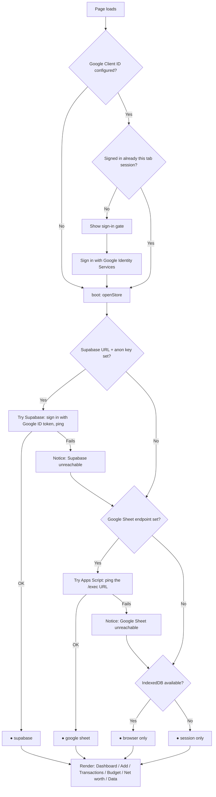

# Ledger — Expense Tracker 2026

A static UI on GitHub Pages that reads and writes a **Google Sheet** as its database
by default, with an optional **Supabase/Postgres** backend as a preferred alternative
once configured, and IndexedDB/in-memory storage as an automatic offline fallback.
Add, edit or delete an expense and the change lands immediately in whichever backend
is active. Charts and the dashboard render from that same data.

No server of your own. No build step. No npm install for the app itself.

---

## How it decides where your data lives

Every page load runs the same decision chain — `openStore()` in `assets/store.js` —
and the small `●` indicator in the top-right corner of the app always tells you which
branch it landed on. Supabase is tried first if configured, then the Google Sheet,
then the browser falls back to storing data locally.



Whichever backend is active, `app.js` never knows the difference — it only ever calls
`state.store.list()` / `.add()` / `.getBudget()` / etc. All four adapters
(`SheetsStore`, `SupabaseStore`, `LocalStore`, `MemoryStore`) implement the same shape.

**Supabase is experimental.** The client is fully wired (sign-in, reads, writes,
budget, balances, debts), but no schema or Row Level Security policy ships with this
repo yet — see [Known gaps](#known-gaps). Don't point `SUPABASE_URL` at a project
holding real data until RLS is actually in place; an anon key with no RLS is
equivalent to handing out full read/write access to anyone who opens the page.

---

## Read this before you deploy

### 1. Your sheet is publicly readable — fix this

`Expense_Tracker_2026` (ID `1dS6Cmm…SRz70`) opened for me **without any sign-in**.
Anyone holding the URL can read every transaction. Before you use this for real:
**Share → General access → Restricted**.

That does not affect the app. The Apps Script runs as _you_ and reaches the sheet
through your own account, not through link sharing.

### 2. GitHub Secrets cannot keep a secret in a static site

Secrets exist at Actions **build** time. The workflow writes yours into
`assets/config.js`, which is then **served to every visitor**. Anyone can open
devtools and read your endpoint, token, and (if set) Supabase URL/anon key.

So the secret keeps values out of your **repository**, not out of your **deployed
page**. That is a real difference — it stops the URL leaking through a public repo,
git history, or a fork — but it is not access control.

|                                          | Visible in repo | Visible on deployed site |
| ---------------------------------------- | --------------- | ------------------------ |
| Hardcoded in `config.js`                 | **Yes**         | Yes                      |
| Injected from GitHub secret              | No              | **Yes**                  |
| Entered at runtime (Data → Google Sheet) | No              | **No**                   |

**If the sheet holds anything you would mind a stranger reading or writing, leave the
secrets unset and enter the endpoint in the app.** It is stored in your browser's
localStorage and never published. You type it once per browser.

The endpoint URL alone isn't the gate — every request still has to carry a valid
Google ID token that `requireUser()` verifies server-side against `ALLOWED_EMAILS`,
regardless of whether the endpoint was baked in via secrets or typed in at runtime.
Keeping it off the public page is still worth doing (it's one less thing a stranger
can find and start probing), just not the thing actually stopping writes.

The Google Client ID and Supabase anon key are different: both are meant to be
public — access is enforced server-side (Apps Script's email allow-list, or
Supabase RLS once it exists), not by hiding the identifier.

---

## Setup

### Step 1 — Apps Script

1. Open **Expense_Tracker_2026** → **Extensions → Apps Script**.
2. Delete the placeholder, paste all of `google-apps-script/Code.gs`.
3. Change `SHARED_TOKEN` to a long random string. The script refuses to run while it
   still reads `CHANGE_ME`.
4. Run the `setup` function once and approve the permission prompt (an "unverified
   app" warning is expected for your own script — **Advanced → Go to …**).

   This adds an **ID** column in `M` on the Transactions tab and numbers your existing
   230 rows 1–230. Columns A–L are not touched.

5. **Deploy → New deployment → Web app** — Execute as **Me**, Access **Anyone**.
6. Copy the URL ending in `/exec`.

> "Anyone" is required: visitors to a Pages site are not signed in to Google. The
> shared token is what stops a stranger who guesses the URL. After any edit to
> `Code.gs` you must **Deploy → Manage deployments → Edit → New version**, or the old
> code keeps serving.

### Step 1b — Google sign-in (required)

`requireUser()` in `Code.gs` runs unconditionally on every request and throws
immediately if `OAUTH_CLIENT_ID` is still `CHANGE_ME` — the deployed app cannot read
or write the sheet at all until this is set up, not just "less secure without it."
Every request must carry a signed Google ID token that `Code.gs` verifies
server-side and checks against an email allow-list before touching the sheet.

1. [console.cloud.google.com](https://console.cloud.google.com) → new project → APIs
   & Services → Credentials → **Create OAuth client ID** → Web application.
2. Authorised JavaScript origins: your GitHub Pages URL, plus
   `http://localhost:8080` if you run the app locally.
3. Paste the client ID into `OAUTH_CLIENT_ID` in `Code.gs` **and** into
   `GOOGLE_CLIENT_ID` in `assets/config.js` (or the `GOOGLE_CLIENT_ID` repo secret).
4. List the allowed emails in `ALLOWED_EMAILS` in `Code.gs`.

The client ID itself is public by design — it appears in the page source. Security
comes from the origin restriction on the OAuth client plus the server-side email
check, not from hiding the ID.

### Step 2 — Deploy the frontend

```bash
git init && git add . && git commit -m "Ledger"
git branch -M main
git remote add origin https://github.com/<you>/<repo>.git
git push -u origin main
```

**Settings → Pages → Source: GitHub Actions.** (Not "Deploy from a branch" — the
workflow needs to generate `config.js` first.)

Optional, per the warning above — **Settings → Secrets and variables → Actions**:

| Secret              | Value                                       |
| ------------------- | ------------------------------------------- |
| `SHEETS_ENDPOINT`   | the `/exec` URL                             |
| `SHEETS_TOKEN`      | same string as `SHARED_TOKEN`               |
| `GOOGLE_CLIENT_ID`  | the OAuth client ID, if used                |
| `SUPABASE_URL`      | your Supabase project URL, if used          |
| `SUPABASE_ANON_KEY` | the project's anon/publishable key, if used |

Skip all of them to keep every value off the public page; connect under **Data →
Google Sheet** instead, which stores the endpoint only in your browser.

### Step 2b — Supabase (optional, experimental)

`assets/store.js` already implements a full `SupabaseStore` adapter — signed in via
the same Google ID token the app already obtains (`signInWithIdToken`), reading and
writing `transactions`/`budget`/`balances`/`debts` tables through `supabase-js`. To
actually use it:

1. In your Supabase project: **Authentication → Providers → Google** → enable it, and
   add your app's `GOOGLE_CLIENT_ID` under **Authorized Client IDs**. This is a
   per-project setting, unrelated to how you personally log into supabase.com.
2. Create `transactions`, `budget`, `balances`, and `debts` tables matching the shapes
   `SupabaseStore` expects in `store.js` (this repo does not ship a schema migration
   for Supabase yet — see [Known gaps](#known-gaps)).
3. Write Row Level Security policies scoping each table to your household's signed-in
   emails, mirroring `ALLOWED_EMAILS` in `Code.gs`. **Do not skip this** — without RLS,
   the public anon key gives every visitor full read/write access.
4. Set `SUPABASE_URL`/`SUPABASE_ANON_KEY` (build-time secret, or paste directly into
   `assets/config.js` for local testing only — never commit real values there).

`migrate.mjs` does a one-time bulk load of a Ledger `.xlsx` export into Postgres over
a direct connection string, with mandatory reconciliation (row counts and per-type
sums must match exactly between the export and what landed in the database, or it
refuses to report success). It's a standalone Node script (`node migrate.mjs
<export.xlsx> --db-url=postgres://... [--dry-run]`), not part of the deployed app.

### Step 3 — Nothing to import

Your 230 rows are already in the workbook, so the app reads them the moment it
connects. The `data/seed*.json` files now only seed **browser storage** for anyone
trying the app without a sheet.

### Local development

```bash
python3 -m http.server 8080   # http://localhost:8080
```

ES modules need an HTTP origin; opening `index.html` from disk fails on CORS.

---

## How writes reach the sheet

The script writes into the **tracker's own layout**, so your existing Dashboard,
Pivot and six charts keep working — the web UI and the spreadsheet are two front ends
over one dataset.

```
Transactions   A Date · B Month · C Year · D Type · E Category · F Subcategory
               G Description · H Amount · I Payment · J Account · K Recurring
               L Notes · M ID          ← M is added by the script; A–L untouched
Budget         categories matched by name in column A, months written to C–N only.
               Column B (Type) and O (annual formula) are never written.
```

Three decisions worth knowing, because getting them wrong corrupts the workbook:

- **Column A is written as a real Date object, not a string.** The tracker's B column
  is `=TEXT($A2,"mmm")`, and `TEXT()` on a string returns an error that would poison
  every downstream `SUMIFS`.
- **B and C are left alone wherever a formula already exists**, so the sheet keeps
  calculating for itself. Past the pre-filled block they are written as plain values.
- **Deleting clears a row instead of removing it**, and new rows reuse the first
  cleared slot. Deleting rows outright would eat the pre-filled formula block
  (rows 2–501) one row at a time.

The script also **refuses to run if the Transactions header row has been renamed or
reordered**, rather than writing into the wrong columns.

Two Apps Script constraints shaped the client:

- **Only GET and POST exist.** Mutations are POSTs carrying an `action` field.
- **A JSON content-type triggers a CORS preflight Apps Script cannot answer.** The
  client posts `text/plain;charset=utf-8`, a safelisted value that skips preflight.
  Change that header and every write breaks.

Expect roughly 0.3–1s per write. That is Apps Script, not the app. Supabase writes,
when that backend is active, go through normal Postgres inserts/updates instead and
do not share these constraints.

## Verified

The real `Code.gs` was run against a simulated `SpreadsheetApp` seeded from your actual
workbook — title rows, header row, 230 data rows, the formula block down to row 501,
and the Budget tab's categories at rows 4–22 — and driven by the real client over HTTP.
20 checks pass, including: reads all 230 existing rows ($23,592.39), back-fills ids
1–230, adds the ID column without disturbing A–L, inserts into the formula block so
`Month` and `Year` still compute themselves (`Aug` / `2026`), update in place, delete
clears and the next insert reuses that slot, budget writes land in C–N with column B
and O untouched, and a renamed header is refused rather than silently mis-mapped.

Monthly figures through the sheet still match your original file exactly:
**Jan $4,496.07 · Mar $4,134.73 · Apr $3,818.57 · Jul $11,143.02**.

## Data model

One row per transaction. **Amount is always positive** — `type` carries the sign. This
keeps `SUMIFS` clean in exports, and is enforced in the form, in `normalise()`, and in
`Code.gs`.

```
id  date  type  category  subcategory  description  amount  payment  account  recurring  notes  person
```

`person` (`Ramesh`, `Surya`, `Joint`, or unassigned) was added after the initial
import; rows without it are treated as `Unassigned` everywhere.

Budget lives on its own tab per year (`Budget 2026`, `Budget 2027`, ...), one row per
category, twelve month columns. **Zero means "not budgeted"** and is excluded from
Budget Used — which is why Travel does not flag as over budget despite July's $7,288.

Net worth (dated Asset/Liability balance snapshots) and Debts & Loans (principal +
payment history) are tracked on their own tabs, deliberately separate from
Income/Expense so a balance or a receivable is never double-counted against actual
cash flow. Dividends is its own transaction `type`, excluded from Income and Savings
Rate, shown in its own Dashboard section.

Edit rows directly in the sheet if you prefer; the app rereads on load and on
**Data → Reload from sheet**. Do not reorder or rename the header row, and do not
reuse an `id`.

---

## Known gaps

- **Supabase has no shipped schema or RLS policies.** The client adapter is complete,
  but you must create the tables and write your own Row Level Security policies
  before pointing `SUPABASE_URL` at a project with real data — see Step 2b.
- **No payment methods in the seed data** — the source file never recorded them, so
  the doughnut chart is empty until you fill that field. The dashboard reports how
  much spend is unattributed rather than hiding it.
- **No income rows**, so Net reads negative and Savings Rate shows `—` until you add
  some.
- **Import expects a flat table** with `Date` and `Amount` columns. The original
  month-per-tab layout is not auto-detected.
- **No offline queue.** Lose connectivity and writes fail loudly rather than silently
  diverging from the backend.
- **Ids are reused after deletion.** `nextId` is max+1, so deleting the highest id
  frees that number. Harmless for one person; it would matter with concurrent editors
  on the Sheets backend (Postgres identity columns on Supabase don't have this issue).
- **Edit the sheet directly if you like**, but do not rename or reorder the
  Transactions header row, and do not hand-type a duplicate ID in column M.
- Apps Script quotas apply — generous for personal use, but a tight loop will hit them.

---

## Layout

```
index.html                    app shell + sign-in gate + connection indicator
assets/config.js              endpoint/keys config; overwritten at deploy
assets/store.js               SheetsStore / SupabaseStore / IndexedDB / memory adapters + constants
assets/xlsxio.js              aggregation, xlsx export, import with header aliasing
assets/charts.js              Chart.js builders
assets/app.js                 routing, views, forms, Google sign-in gate, global state
data/seed*.json               230 rows from Expense.xlsx + derived budgets (browser-storage seed only)
google-apps-script/Code.gs    paste into Extensions → Apps Script
migrate.mjs                   one-time XLSX → Postgres bulk loader for the Supabase path (not part of the deployed app)
.github/workflows/deploy.yml  injects secrets, validates, publishes to Pages
```

From CDN, no install: Chart.js 4.4.1, SheetJS 0.20.3, Space Grotesk + JetBrains Mono,
and (lazily, only if Supabase is configured) `@supabase/supabase-js@2`.
